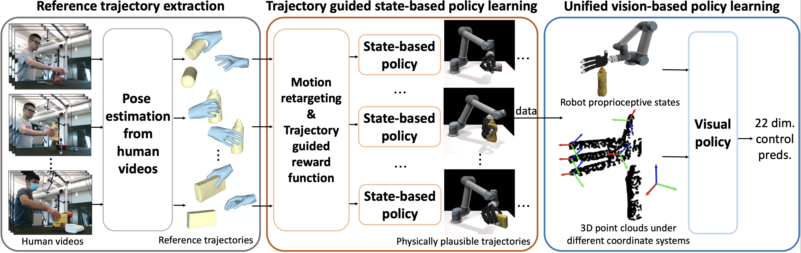

<div align="center">

# ViViDex: Learning Vision-based Dexterous Manipulation from Human Videos

[Zerui Chen](https://zerchen.github.io/)<sup>1</sup> &emsp; [Shizhe Chen](https://cshizhe.github.io/)<sup>1</sup> &emsp; [Etienne Arlaud](https://scholar.google.com/citations?user=-0kdc5cAAAAJ&hl=fr)<sup>1</sup> &emsp; [Ivan Laptev](https://www.di.ens.fr/~laptev/)<sup>2</sup> &emsp; [Cordelia Schmid](https://cordeliaschmid.github.io/)<sup>1</sup>

<sup>1</sup>WILLOW, INRIA Paris, France <br>
<sup>2</sup>MBZUAI

<a href='https://zerchen.github.io/projects/vividex.html'></a>
<a href='https://arxiv.org/abs/2404.15709'></a>
</div>

This is the implementation of **[ViViDex](https://zerchen.github.io/projects/vividex.html)** under the MuJoCo simulator, a novel system for learning dexterous manipulation skills from human videos:


## Installation 👷
```
git clone --recursive https://github.com/zerchen/vividex_mujoco.git

conda create -n rl python=3.10
conda activate rl
conda install pytorch==2.4.1 torchvision==0.19.1 torchaudio==2.4.1 pytorch-cuda=12.1 -c pytorch -c nvidia
pip install -r requirements.txt
conda install pytorch-scatter -c pyg

cd openpoints/cpp/pointnet2_batch
python setup.py install --user
cd ../

cd subsampling
python setup.py build_ext --inplace
cd ..

cd pointops/
python setup.py install --user
cd ..

cd chamfer_dist
python setup.py install --user
cd ../emd
python setup.py install --user
cd ../../../
```

## Usuage 🚀
```bash
# Train the state-based relocation policy
python train.py env.name=seq_name

# Train the state-based pouring policy
python train.py env=dexycb_pour

# Train the state-based placing-inside policy
python train.py env=dexycb_place
```
Available seq_name can be found at: `hand_imitation/env/models/assets/objects/trajectories/ycb`. You can also download trained checkpoints [here](https://drive.google.com/drive/folders/1Y_GXjW9hgnc_77TsLAT5JgJEcKVWZlrw) and check their config files for a reference. Please note that change 36 to 42 for L197-198 in `hand_imitation/env/models/control.py` when try to load my trained checkpoints for pour and place inside tasks. When state-based policies are trained, rollout these policies and train the visual policy using `tools/dist_bc_train.py`.

## Acknowledgements
Parts of the code are based on [DexMV](https://github.com/yzqin/dexmv-sim) and [TCDM](https://github.com/facebookresearch/TCDM). We thank the authors for sharing their excellent work!

## Citation 📝
If you find ViViDex useful for your research, please consider citing our paper:
```bibtex
@inproceedings{chen2025vividex,
  title={{ViViDex}: Learning Vision-based Dexterous Manipulation from Human Videos},
  author={Chen, Zerui and Chen, Shizhe and Arlaud, Etienne and Laptev, Ivan and Schmid, Cordelia},
  booktitle={ICRA},
  year={2025}
}
```
